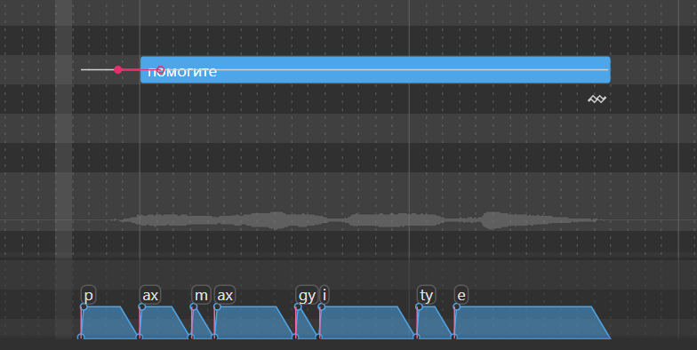

# hhskt_ru_phonemizer
Russian Phonemizer for DiffSinger for OpenUTAU utilizing a custom Russian G2p model.

## How to Install

Download `diffs_ru_hhskt.dll` from [this](https://github.com/Megageorgio/hhskt_ru_phonemizer/releases/download/v1.0.0/diffs_ru_hhskt.dll) link, and drag the file into an open OpenUTAU window. Don't forget to restart OpenUTAU.

This phonemizer looks for `dsdict-ru-hhskt.yaml` to load phonemes, grapheme overrides and phoneme replacements.